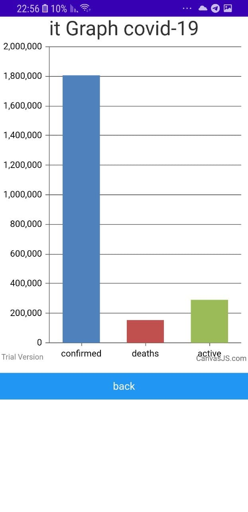
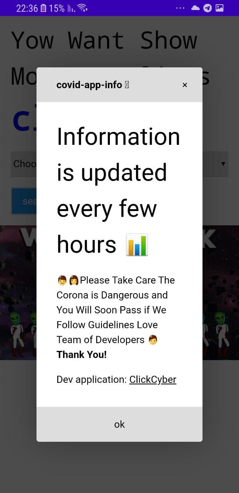

<h1> This is a site that presents an up-to-date graph in each country regarding the corona virus </h1>

<ul>
<a style="color:white; background-color:blue; border:5px solid;" href="https://covid-informations.herokuapp.com/">show website</a>
 
<a style="color:white; background-color:blue; border:5px solid;" href="https://play.google.com/store/apps/details?id=com.besys.covidinfo">show in google play</a>

 Technology I used to create the project 

<li> python</li>
<li> Java</li>
<li> HTML</li>
<li> CSS</li>
</ul>

<h3 > example Graph </h3>

<h3 > example search </h3>

<h3 > example alert </h3>

<h4> links </h4>
https://covid-informations.herokuapp.com/
 
https://play.google.com/store/apps/details?id=com.besys.covidinfo
